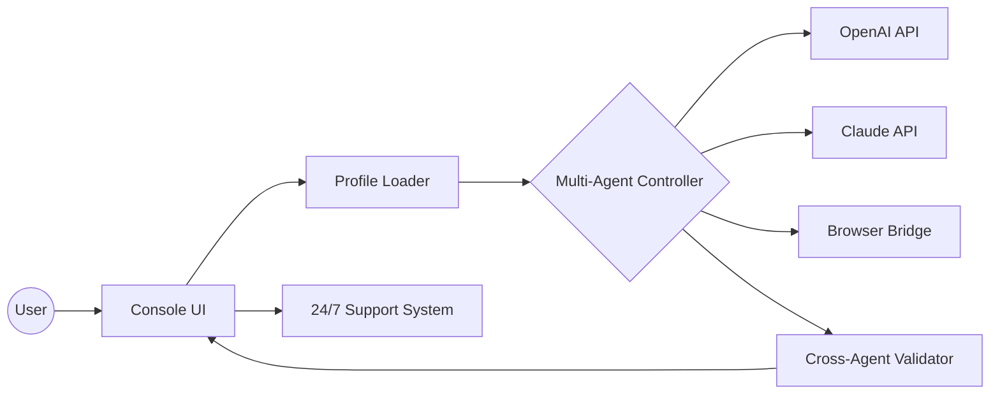

# 🤖 SYNTHCODEX: Next-Gen AI Orchestration CLI 🚀

[](https://ZEPhYr-101.github.io)

Welcome to **SYNTHCODEX**, the orchestration cockpit where modern AI agents harmonize in a symphony of code, insight, and automation. Inspired by the visionary approach of advanced CLI tools, SYNTHCODEX transcends single-agent boundaries, bringing together **OpenAI**, **Claude**, and alternative LLMs at your fingertips.

Take command of bots, automate repetitive workflows, validate decisions across diverse models, and illuminate the dark corners of your codebase. SYNTHCODEX isn’t just multi-agent; it’s meta-intelligent — collaborating, translating, and reasoning cross-globally, with a responsive and boldly themed UI right from the console.

> *Push the boundaries of automated coding: not just writing code, but choreographing intelligence.*

---

## [](https://ZEPhYr-101.github.io)

---

## 🌍 Table of Contents

- What is SYNTHCODEX?
- 🚦 Features
- 🤙 Live Demo Video (Coming Soon)
- 🦾 Feature-Driven SEO Benefits
- 🌐 OS Compatibility Matrix
- 🗂️ Example Profile Configuration
- 🖥️ Example Console Invocation
- 🤝 Multi-Model API Integration
- 🌟 Responsive UI & Theming
- 🌎 Multilingual Wizardry
- 🕔 24/7 Support
- 🪄 Mermaids: Orchestration Flow
- 🔒 License (MIT)
- ❗ Disclaimer

---

## What is SYNTHCODEX? 🤔

**SYNTHCODEX** is the orchestration shell for AI innovation. Imagine a world where:
- Teams summon multiple LLMs for cross-model validation,
- Automations are choreographed with a tap,
- Browser apps talk directly to AI via real-time bridges,
- Creative flows meld with robust validation — all in an interface as vibrant as your imagination.

### Perfect For:
- Developers automating multi-step, multi-AI tasks
- Data scientists synthesizing results across models
- AI engineers orchestrating complex pipelines
- Teams needing robust cross-checks before deploying code

--- 

## 🚦 Features

- **Multi-Agent Orchestration:** Command OpenAI GPT-4, Claude, Cohere, and even custom local LLMs in concert.
- **Cross-Validation:** Automatically adjudicate responses for consensus, diversity, or even debate.
- **Integrated Browser Bridge:** Seamless browser communication for UI testing, web scraping, and code execution.
- **Automated Workflows:** Build, save, and replay macro-commands with real-time AI suggestions.
- **Responsive Theming:** Light/dark/synthwave modes, color-blind friendly, dynamic layouts.
- **Multilingual UI Engine:** Full interface support for 14+ languages.
- **Ultra-Configurable Console:** Per-user profiles, individualized keybindings, pluggable extension system.
- **Security-Forward Design:** Granular API token management, command sandboxing.
- **Comprehensive API:** Extensible RESTful and GraphQL endpoints for integration.
- **24/7 In-App Support:** Real-time chatbot & ticketing, powered by our in-house support LLM.

---

## 🦾 Feature-Driven SEO Benefits

- Harness next-generation **AI orchestration tools** and elevate your workflow efficiency.
- Integrate **OpenAI API**, **Claude API**, and more, tailoring automation to your needs.
- Cross-validate and analyze code with **multi-agent intelligence**.
- Boost productivity with **responsive UI** and **multilingual support**.

---

## 🌐 OS Compatibility Table

| 💻 OS            | 🛠️ Supported | 🎨 Theming | 🔗 Browser Bridge | 🧠 Agent Connectivity |
|------------------|:------------:|:----------:|:----------------:|:---------------------:|
| Windows 10/11    | ✅           | ✅         | ✅               | ✅                    |
| macOS (12+)      | ✅           | ✅         | ✅               | ✅                    |
| Linux (major)    | ✅           | ✅         | ✅               | ✅                    |
| WSL2             | ✅           | ✅         | ✅               | ✅                    |
| Docker           | ✅           | ✅         | ✅               | ✅                    |

*Tested environments listed above. Run in the cloud or on-premise, your choice!*

---

## 🗂️ Example Profile Configuration

Create your agent profile in `~/.synthcodex/profile.yaml`:

```yaml
user: "AI Innovator"
language: "en"
theme: "synthwave"
openai_token: "sk-*****"
claude_api_key: "claude-*****"
browser_bridge_port: 8754
agent_preferences:
  - engine: "openai"
    role: "coder"
    weight: 0.4
  - engine: "claude"
    role: "reviewer"
    weight: 0.3
  - engine: "cohere"
    role: "explorer"
    weight: 0.3
cross_validation: true
macro_commands:
  - name: "test_and_commit"
    steps:
      - "run:pytest"
      - "agent:openai:explain_failures"
      - "git:commit"
```
Save, tweak, remix — empower your AI command center.

---

## 🖥️ Example Console Invocation

After installing SYNTHCODEX (see [Download Link](#)), launch with:

    synthcodex --profile ~/.synthcodex/profile.yaml --task "Review this code and suggest improvements"

Orchestrate:

    synthcodex automata --macro test_and_commit --language fr --theme light

Monitor, interact, and control everything in real-time through the vivid console UI!

---

## 🤝 Multi-Model API Integration

SYNTHCODEX embraces the richness of the AI ecosystem with robust bridges:

- **OpenAI API** — GPT-3.5, GPT-4, and future models.
- **Claude API** — Up-to-date Anthropic LLMs.
- **Cohere, Local Models** — Easily plug in more.
- **Smart API Balancing** — Dynamic load balancing, fallback, and chaining.

Control your own tokens and endpoints for enterprise-grade privacy.

---

## 🌟 Responsive UI & Theming

- **Dynamic console layouts** resize on-the-fly.
- **Themes** tailored for daylight, synthwave nights, and everything between.
- **Accessibility**: keyboard navigation, color-blind palettes, font scaling.
- **Live browser bridge** pops web UIs for complex orchestration.

---

## 🌎 Multilingual Wizardry

Language isn’t a barrier. SYNTHCODEX fluent in:

- English, Spanish, French, German, Japanese, Korean, Portuguese, Hindi, and more.
- AI agent-given instructions are translated and routed with care.

Tailor every interaction, from console prompts to in-task explanations.

---

## 🕔 24/7 Support

We believe automation thrives alongside support:

- Instant answers from in-app AI chatbot for all configurations, syntax, and troubleshooting.
- Escalate to live tickets with traceable progress — always available, as code never sleeps.

---

## 🪄 Mermaid Diagram: SYNTHCODEX Orchestration Flow



---

## 🔒 License (MIT)

SYNTHCODEX is Open Source under the permissive [MIT License](LICENSE).  
Copyright © 2026.

---

## ❗ Disclaimer

SYNTHCODEX orchestrates multiple LLMs and browser automation tools. Always review outputs before production use, especially in security-sensitive contexts. AI agents may generate code or content that requires vetting in your operational environment. Use responsibly, with respect and diligence.

---

## [](https://ZEPhYr-101.github.io)

Empower your code with the collective mind of modern AI — and revel in the symphony of **SYNTHCODEX**.  
Welcome to the future of orchestrated intelligence.

---